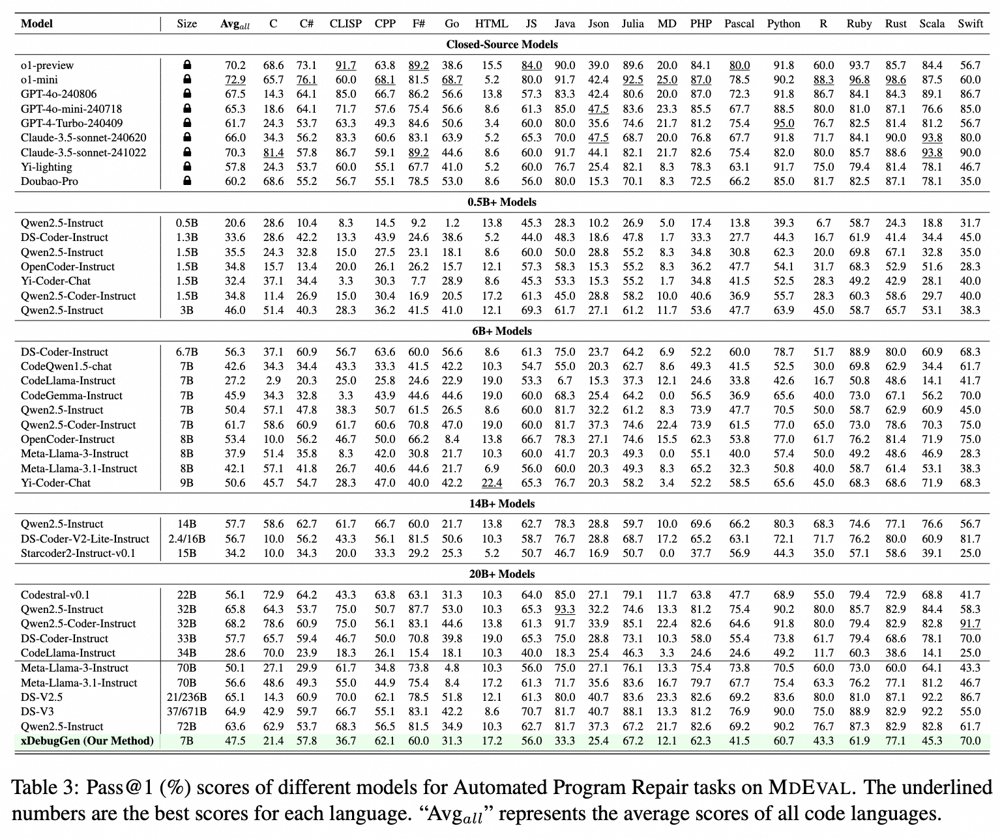

<!-- # MDEVAL: Massively Multilingual Code Debugging -->

# MDEVAL: Massively Multilingual Code Debugging

<div align="center" style="line-height: 1;">
  <a href="" style="margin: 2px;">
    
  </a>
  <a href="" style="margin: 2px;">
    
  </a>
  <!-- <a href="" style="margin: 2px;">
    
  </a> -->

</div>

<hr>
Official repository for our paper "MDEVAL: Massively Multilingual Code Debugging"


<p align="left">
    <a href="https://mdeval-code.github.io/">🏠 Home Page </a> •
    <a href="https://huggingface.co/datasets/Multilingual-Multimodal-NLP/MDEVAL">📊 Benchmark Data </a> •
    <a href="https://mdeval-code.github.io/leaderboard.html">🏆 Leaderboard </a> 
</p>


## Table of contents
- [MDEVAL: Massively Multilingual Code Debugging](#Introduction)
  - [📌 Introduction](#introduction)
  - [🏆 Leaderboard](#leaderboard)
  - [📋 Task](#task)
  - [📚 Data](#data)
  - [💻 Usage](#usage)
  - [📖 Citation](#citation)


## Introduction
**MDEVAL** is a massively multilingual debugging benchmark covering **18** programming languages with **3K** test samples, which substantially pushes the limits of code LLMs in multilingual scenarios.
<p align="center">

</p>


### Task Examples
<p align="center">

</p>


## Results 
<p align="center">

</p>

<p align="center">

</p>


Refer to our <a href="https://mdeval-code.github.io/leaderboard.html">🏆 Leaderboard </a>  for more results.


## Data
<div align="center">

| **Dataset** |  **Download** |
| :------------: | :------------: |
| MDEVAL Evaluation Dataset  | [🤗 HuggingFace](https://huggingface.co/datasets/Multilingual-Multimodal-NLP/McEval)   |

</div>
## Usage


### Environment

We recommend using Docker for evaluation, we have created a Docker image with all the necessary environments pre-installed.

<!-- Docker images will be released soon. -->
Directly pull the image from Docker Hub:


```bash 
# Docker hub:
docker pull multilingualnlp/mceval

docker run -it -d --restart=always --name mdeval_dev --workdir  / <image-name>  /bin/bash
docker attach mdeval_dev
``` 

<!-- ### Inference
We provide the standard format for JSON files obtained after model inference.

```json
{
  "question_id": "",
  "category": "",
  "subtype": "",
  "level": "",
  "example": "",
  "docstring": "",
  "canonical_solution": "",
  "buggy_code": "",
  "test": "",
  "instruction": "",
  "fix_code":"" //model output
}
``` -->

### Evaluation

#### Data Format 
**🛎️ Please prepare the inference results of the model in the following format and use them for the next evaluation step.**

(1) Folder Structure
Place the data in the following folder structure, each file corresponds to the test results of each language. 
```bash 
\data\chat_result\${model}\${task}
  - CPP.jsonl
  - Python.jsonl
  - Java.jsonl
  ...
```
Where "model" represents the model being tested, and "setting" represents the task , for example `doc` , `bug` , `example` , `review` , `ident`


(2) File Format 
Each line in the file for each test language has the following format.
The *fix_code* field is the generated code.
<!-- More examples can be found in [Evualute Data Format Examples](examples/evaluate/) -->
```bash 
{
  "question_id": "",
  "category": "",
  "subtype": "",
  "level": "",
  "example": "",
  "docstring": "",
  "canonical_solution": "",
  "buggy_code": "",
  "test": "",
  "instruction": "",
  "fix_code":"" //model output
}
```


#### Evaluate APR Task
Take the evaluation generation task as an example.
```bash
bash sh excute/apr.sh
```

<!-- ## More Examples
More examples could be found in [Examples](docs/Examples.md) -->

## License
This code repository is licensed under the [the MIT License](LICENSE-CODE). The use of McEval data is subject to the [CC-BY-SA-4.0](LICENSE-DATA).

## Citation
If you find our work helpful, please use the following citations.
```bibtext
@misc{liu2024mdevalmassivelymultilingualcode,
      title={MdEval: Massively Multilingual Code Debugging}, 
      author={Shukai Liu and Linzheng Chai and Jian Yang and Jiajun Shi and He Zhu and Liran Wang and Ke Jin and Wei Zhang and Hualei Zhu and Shuyue Guo and Tao Sun and Jiaheng Liu and Yunlong Duan and Yu Hao and Liqun Yang and Guanglin Niu and Ge Zhang and Zhoujun Li},
      year={2024},
      eprint={2411.02310},
      archivePrefix={arXiv},
      primaryClass={cs.CL},
      url={https://arxiv.org/abs/2411.02310}, 
}
```


<!-- ## Contact  -->
